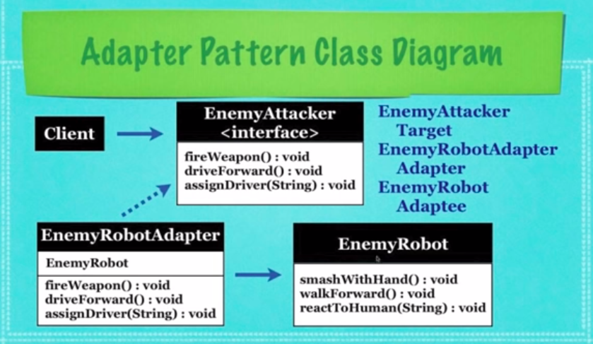

## What Is The Adapter Design Pattern?

* A way of using an object as an **adapter** to translate
  **methods(actions)** from another object known as an
  **adaptee** to the **client(target)**

* Allows the use of two incompatible interfaces
 to work together

* Used when the client expects a (target) interface

* The Adapter class allows the use of the available
  interface and the Target interface

* Any classes can work togethor as long as the Adapter
  solves the issue that all classes must implement every method
  defined by the shared interface

