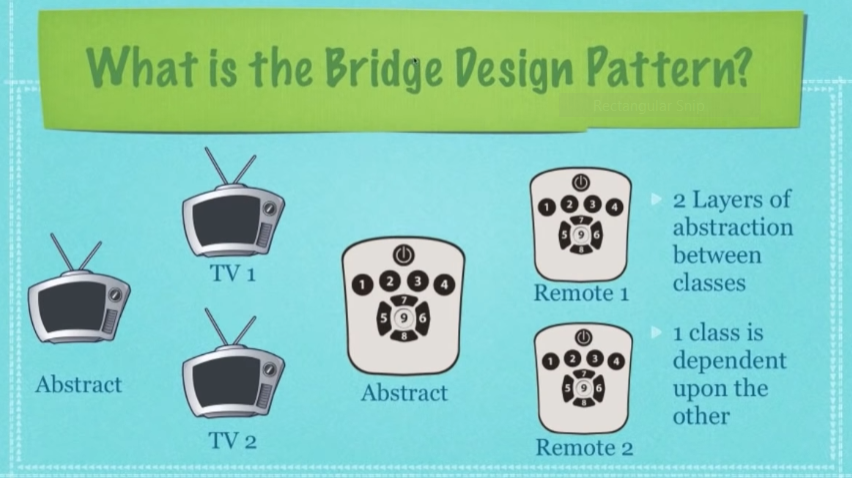

## What Is The Bridge Design Pattern?

* A design pattern that builds upon the Adapter Design Pattern
  such that we no longer need an "adapter" interface instead we 
  seperate use an abstraction thous decoupling the abstraction from implementation 

* A design pattern used to decouple an abstraction from it's
  implementation so that the two can vary independently

* Used for progessively adding functionality while separating out major
  differences using abstract classes

  

## When To Use The Bridge Design Pattern?

* When you want to be able to change both the abstractions(abstract
  classes) and concrete classes independently

* When you want the first abstract class to define the rules

* When you want the concrete class add additional rules

* When you want an abstract class has a reference to the concrete class and it
  defines abstract methods that will be defined