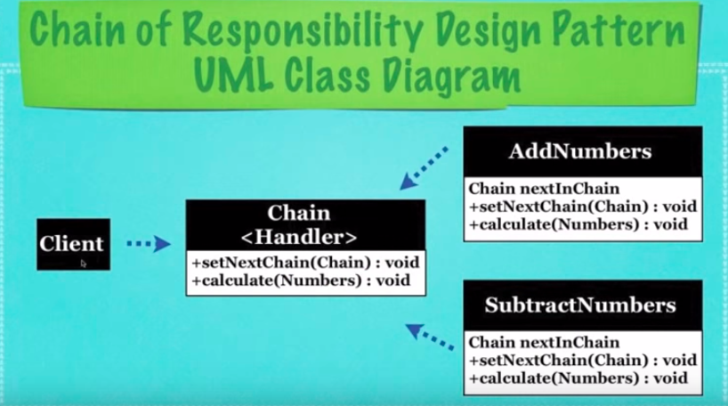

## What Is The Chain Of Responsibility Design-Pattern?

* A design pattern that sends data to an object and if that
  object cannot use said data, it may send the date over to 
  any number of other objects that may use it
  
  * For Example:
  * 4 Objects that can either add, substract, multiply, or divide
    Send 2 numbers and a command and allow these 4 objects to decide
    which can handle the requested calculation

