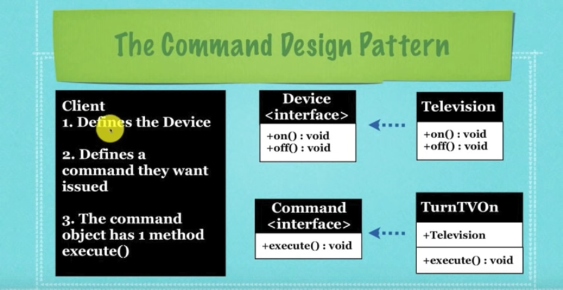

## What Is The Command Design Pattern

* A design pattern where an **invoker** can be used as a way
  of letting a **reciever** know what to execute when a **command**
  is sent to it

* The Command Pattern is a behavioural design pattern in
  which an object is used to represent and encapsulate all the
  information needed to call a method at a later time

* This information includes the method name, the object that owns
  the method and values for the method parameters

* Allows storage of lists of code that is executed at a later time
  or many times

* Allows the ability to undo commands

* For example:
  A client says _"I want a specific **command** to run when execute() is
  called on one of these encapsulated(hidden) objects"_

* An object called the **invoker** transfers this **command** to another
  object called a **reciever** to execute the right code

  * TurnTvOn -> DeviceButton -> TurnTVOn -> Television.TurnTVOn()

  
  

## Benefits Of The Command Design Pattern

* Allows a list of commands to be set aside for later use

* Allow a class to store procedures to be executed at any time

* Allows multiple commands to be stored in a class for repeated use

* Allows "undo" type of commands

* However the number of classes created to house all these procedures is alot
