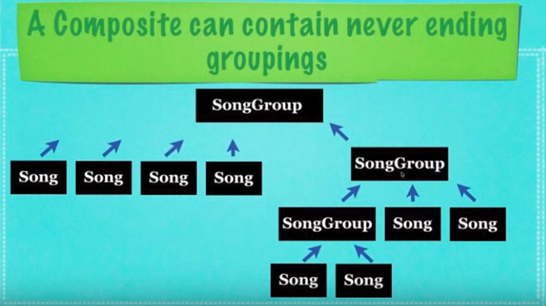

## What Is The Composite Design Pattern ?

* A design pattern where one object who implements
  an **interface** is referred to as a **composite**
  and each composite can contain a **list** of **leafs**
  or child objects and or other composites that contain
  other **leafs** (basically a neverending list of groups
  of objects)

* A design pattern that allows you to treat individual
  objects and compositions of objects uniformily

* They allow representation of part-whole hiearchies
  * (when components can be further divided into smaller 
    and smaller components)

* Data can be structered, or it can represent the inner workings 
  of every part of a whole object individually

## Implementation
* **Abstraction**: An abstract class which allows the implementor (**Composite**) to
  house other objects(**leafs**) who implement this same interface
  _by groups or by a single amount_