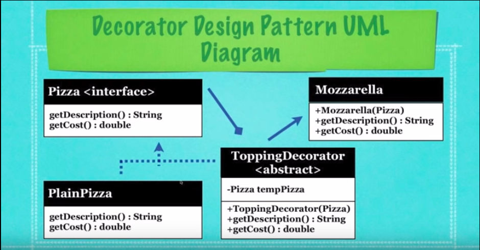

## What Is The Decorator Design Pattern?

* _**Decorating** an object with other objects at runtime_

* A design pattern that allows you to modify an object dynamically

* Used when you want the capabilities of inheritance with
  subclasses, but need the functionality added at runtime

* It is more flexible than inheritance

* Simplifies code, due to adding functionality using many simple
  classes

* Rather than rewrite old code you can extend new code

* Diagram Legend:
  * `+` **public** _instance variable/field/abstract method_