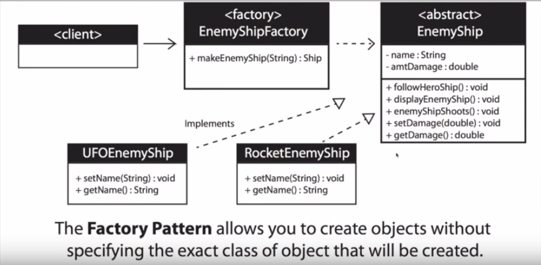

## What Is The Factory Design Pattern?

* _**A design patter where a class is used
  as a factory to house multiple classes
  that implement the strategy design pattern**_

* When a method returns one of several possible classes that share a common super class

  * Example:
  * Creating a new enemy in a  game
  * Random number generator picks a number assigned to a specific enemy
    * The factory returns the enemy associated with that number

* **The class is chosen at runtime**

## When To Use The Factory Pattern?

* When you don't know ahead of time what class object is needed

* When all of the potential classes are in the same subclass hiearchy

* To centralize class selection code

* When the user should not have knowledge every subclass

* To encapsulate object creation

* Diagram Legend:
  * `+` **public** _instance variable/field/abstract method_

