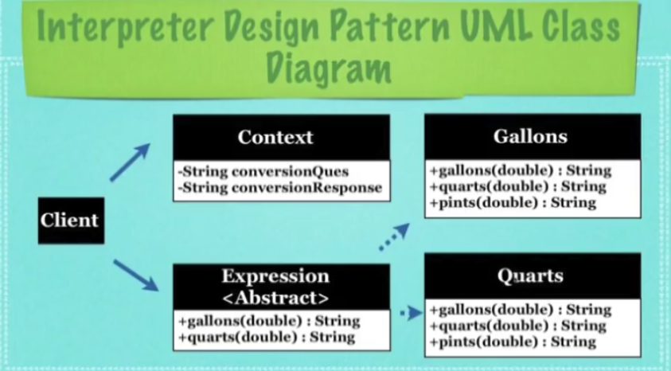

## What Is The Interpreter Design Pattern ?

* A design pattern used to convert one representation of data into
  another via:

* The **Context** contains the information that will be interpreted

* The **Expression**, an abstract class that defines all the methods
  needed to perform the different conversions

* The **Terminal** or **Concrete Expression**, which provides
  specific conversions on different types of data

