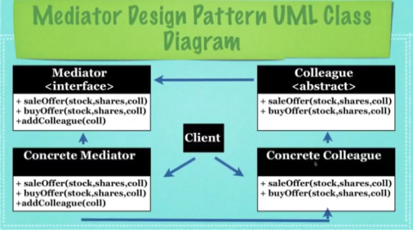

## What Is The Mediator Design Pattern ?

* A design pattern that allows loose coupling by encapsulating the
  way disparate sets of objects interact and communicate with each
  other. Allows for the actions of each object set to vary independently of one another

* A design pattern used to handle communication between related
  objects known as **Colleagues**

* All communication is handled by the **Mediator** while the
  **Colleagues** do not know any information on how
  each of them operates

# Implementation
* **Abstraction**: A class shared by all objects which
  will interact with other instances of this class 
  via the Mediator, **Colleagues**

* **Mediator**: An **interface** which will handle all interaction
  between **Colleagues**