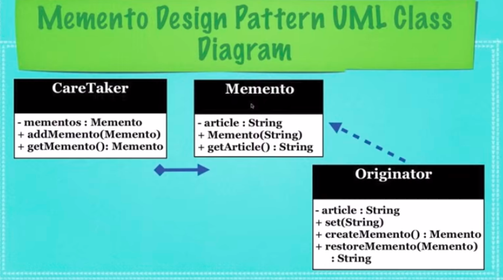

## What Is The Memento Design Pattern?

* A design pattern used to store previous states of an object easily

* **Memento**: The basic object that is stored in different states

* **Originator**: _Sets & Gets values_ from the currently targeted
  **Memento**. _Creates new Mementos_ and **assigns current values to them**

* **Caretaker**: Holds an **ArrayList** that _contains all previous
  versions of the Memento_. It can _store & retrieve stored Mementos_

