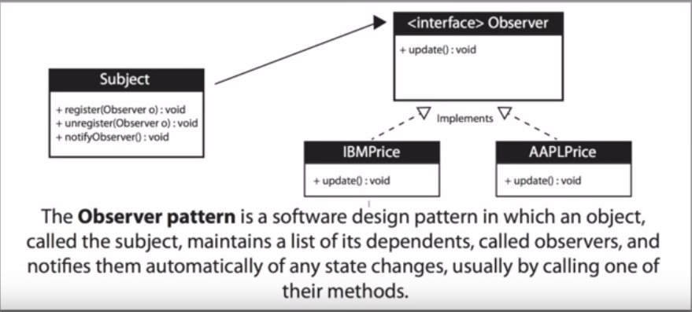

## When To Use The Observer Pattern?

* A mailing list with a **subject** as the
  **sender** to all its **subscribers/observers** and what do all **subscribers/observers** get... **updates***

* When you need many other objects to receive an update when another object changes
  * Example:
    * Stock market with thousands of stocks needs to send updates
      to objects representing individual stocks
    * The subject(publisher) sends many stocks to the **observers**
    * The **observers**(subscribers) subscribe to what they want    and expect to receive a notification when new content is available

## Benefits of using the Observer Pattern

* Loose coupling is a benefit
  * The subject(publisher) doesn't need to know 
    anything about the observers(subscribers)
* Negatives
  * The subject(publisher) may send updates that
    don't matter to the observer(subscribers)

* Diagram Legend:
  * `+` **public** _instance variable/field/abstract method_

# Implementation

* **Subject**: An **interface** which the object sending
  data will implement containing methods with the ability
  to:
    * Register,
    * Unregister,
    * Notify
  an observer

* **Observer**:  An **interface** which the object recieving
  new data (via an _update_ method) will implement
  * The concrete implementation must contain a reference to a
    conrete implementation of the **Subject** in it's contructor
    this enables the **Subject** implementation to add the instance
    to it's **list of senders**