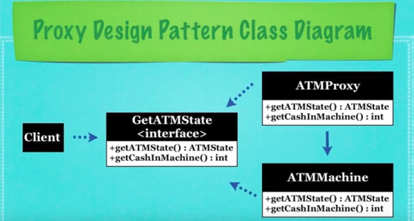

## What Is The Proxy Design Pattern?

* A design pattern which provides a class which will limit
  access to another class
  * This is often done for security reasons, when an object
    is intensive to create, or is accessed from a remote location

## Implementation
* **Interface**: An interface implemented by the
  proxy for the **Target Object** this acts as a 
  retriction to all the data the proxy can access
  by creating a new instance of the target object
  and calling a given method within the implmentations
  of the abstract methods defined by the interface
  * The methods are usually named after methods
    the target object contains

* **Target Object**: This will be the object whose access
  will be restricted