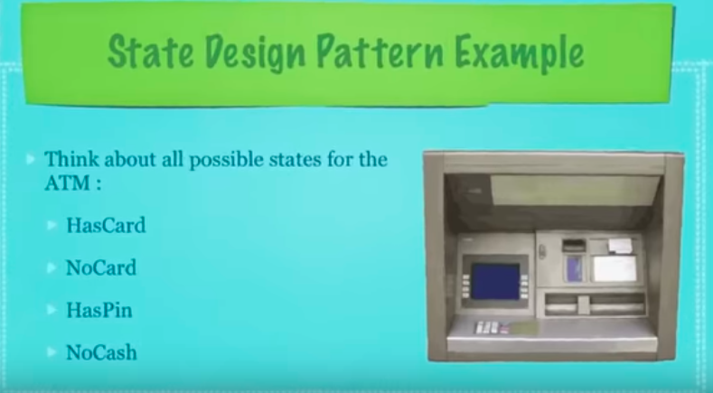
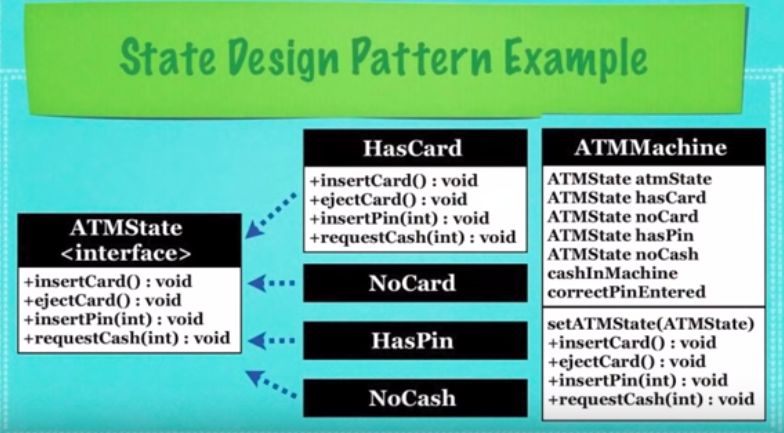

## What Is The State Design Pattern?

* A design pattern that allows an object to alter it's
  behavior when it's internal state changes(this makes the object
  appear to have changed it's class)

* For Example:
  * Context (Account): Maintains an instance of a Concrete State
    subclass that defines the current state

  * State: Defines an interface for encapsulating the behavior
    associated with a particular state of Context

  * Concrete State: Each subclass implements a behavior associated
    with a state of Context 

* When implementing this design pattern you'll want to start
  with a long list then shrink it down to just the essential
  states
  * Then you'll want to think about the various use cases for
    each state

