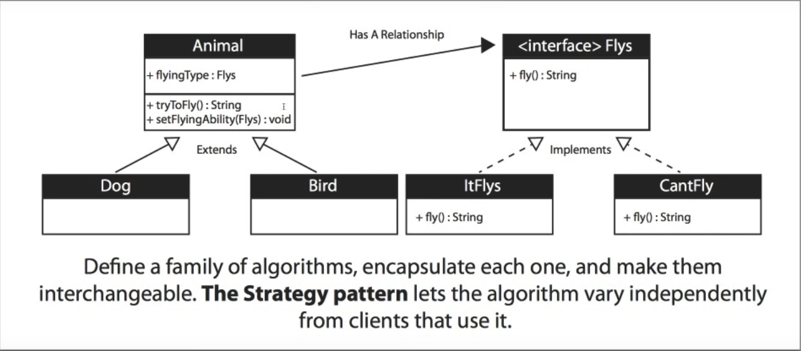

## Stategy Design Pattern Diagram

* Diagram Legend:
  * `+` **public** _instance variable/field/abstract method_

## When To Use The Strategy Pattern?

* When you want to define a class that will have one behavior that is similar to other behaviors in a list (**A strategy for handling all possible instances of a certain problem**)

  * _Example:_
  * _I want a class object to be able to choose from_
    * Not flying
    * Flying with wings
    * Flying super fast

* **When you need to use one of several behaviors dynamically**

### Other Use Cases

* Often reduces long list of conditionals
* Avoids duplicate code
* Keeps class changes from forcing other class changes
* Can hide complicated/secrect code from the user
* Negative: increased number of objects/class

## Implementation
* **Interface**: Contains a family of algorithms for each
  instance of a problem

* **Object**: Contains a reference to the **Interface** and a method
  to switch between classes within the **Interface**