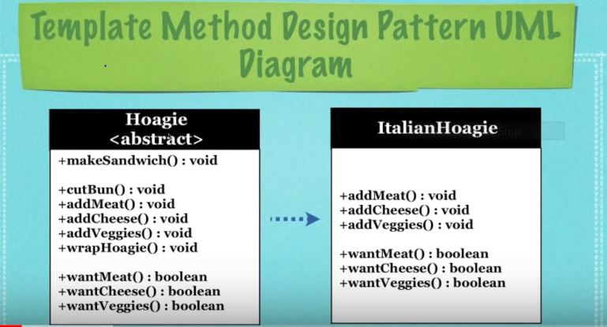

## What Is The Template Method Design Pattern?

* A design pattern used to create a group of subclasses that have to
  execute a similar group of methods

* An abstract class is created that contains a method called the
  **Template** method

* The subclasses can override some of the methods calls

* Diagram Legend:
  * `+` **public** _instance variable/field/abstract method_
