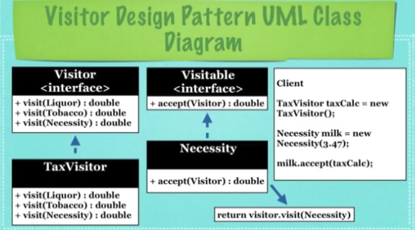

## What Is The Visitor Design Pattern?

* A design pattern that allows the addition of methods to classes
  of different types without much altering of the classes themselves

* Allows the creation of different methods depending on the class
  used

* Allows definition of external classes that can extend other
  classes without majorly editing them

## Implementation
* **Visitor**: An interface to be implemented which will add
  extra functionality to a **Visitable** object

* **Visitable**: An interface to be implemented which can be give
  extra functionality to the implementor via a **Visitor** object